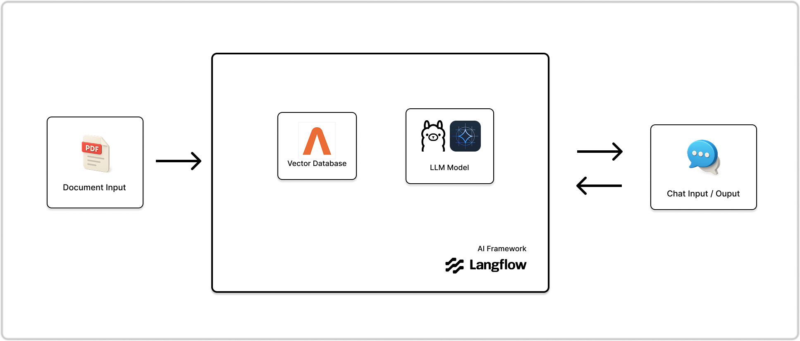
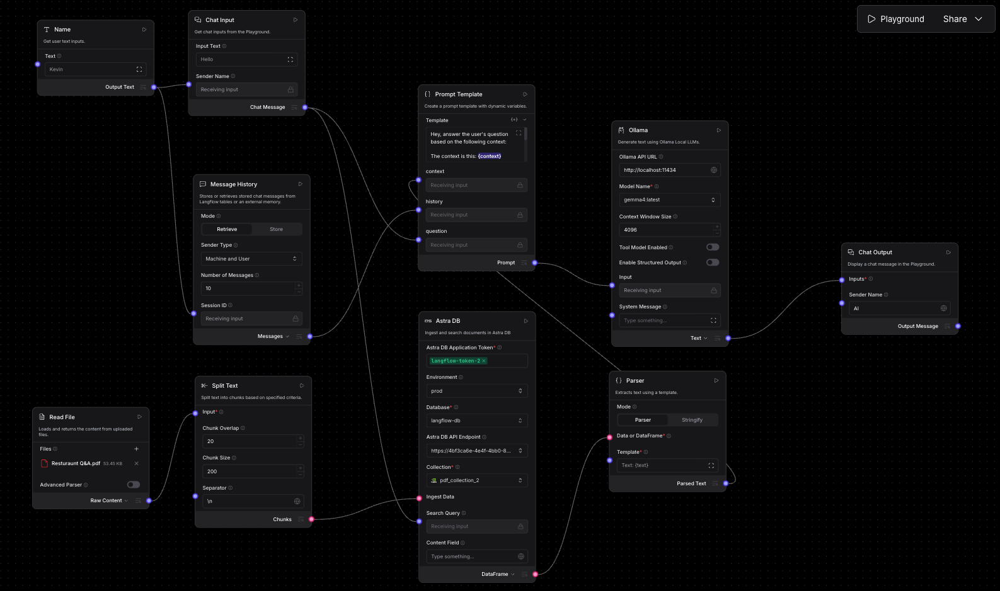
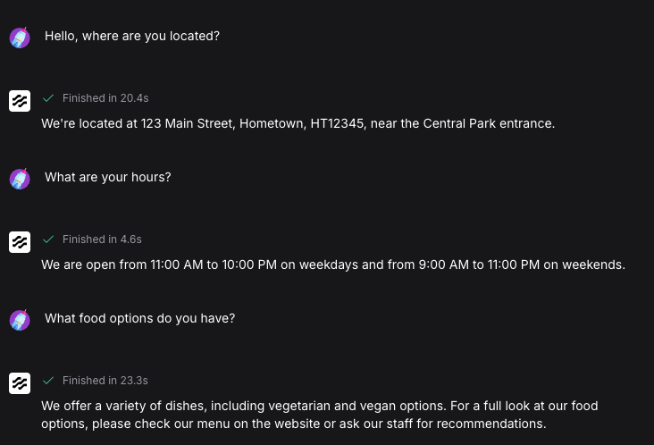

# Purpose
- Develop a simple local AI workflow using the Retrieval-Augmented Generation (RAG) AI design pattern
- Experiment with multiple open-weight AI models and assess performance
- Gain exposure and hands-on experience with the latest AI tools

# Build

## RAG-Based LLM App
- Takes PDF document as input and allows user to ask questions about the document via chat

## Tech Stack
- AI Framework: **LangFlow**
- LLM Model: **Gemma 4 + Ollama**
- Vector Database: **DataStax Astra DB**

## Architecture


## Flow


## Sample Chat Input / Output


# Insights
- Using model ```gemma4:latest``` over ```qwen3.5:latest``` improved response times significantly
  - Average of 50s for ```qwen3.5``` verseus average of 20s for ```gemma4```

# Local Deployment
1. Clone Git repository in local environment
2. Execute: ```docker compose up```
3. Access local instance of Langflow at: ```http://localhost:7860```